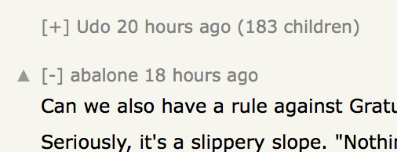

# Hacker News Collapse

Simple browser extension for collapsing Hacker News comment trees. Adds a collapse symbol to the left of comments.

To install the Safari extension, open the `hackernews-collapse.safariextz` extension file. To install the userscript, open `hackernews-collapse.user.js` in Tampermonkey (not tested with Greasemonkey).

Existing tabs need to be reloaded before using the extension.

---

Based on a [bookmarklet by Alexander Kirk](https://alexander.kirk.at/2010/02/16/collapsible-threads-for-hacker-news/). Changes to the original script:

- Show collapse symbol on the left
- Align collapse buttons vertically
- Option to hide number of child comments when collapsing
- Fix for various layout problems where comments change their position on collapsing
- Other bug fixes
